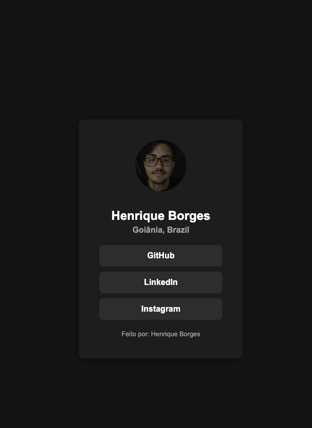

# Social Profile - Henrique Borges

Este é um projeto simples de um **perfil social** desenvolvido apenas com **HTML e CSS**, inspirado em um layout moderno e minimalista.

## ✨ Funcionalidades

- Foto de perfil
- Nome e localização
- Links sociais (GitHub, LinkedIn, Instagram)
- Estilo escuro (dark mode)
- Layout centralizado

## 📱 Responsividade

O design foi pensado para funcionar bem em **diferentes tamanhos de tela**, com destaque para dispositivos móveis.  
Utilizamos `media queries` para ajustar espaçamentos, tamanhos de fonte e responsividade dos botões.

---

👨‍💻 **Feito por:** Henrique Borges  
🔗 [LinkedIn](https://www.linkedin.com/in/henriqueborgesprog/) | [GitHub](https://github.com/HenriqueBorgesProg)
